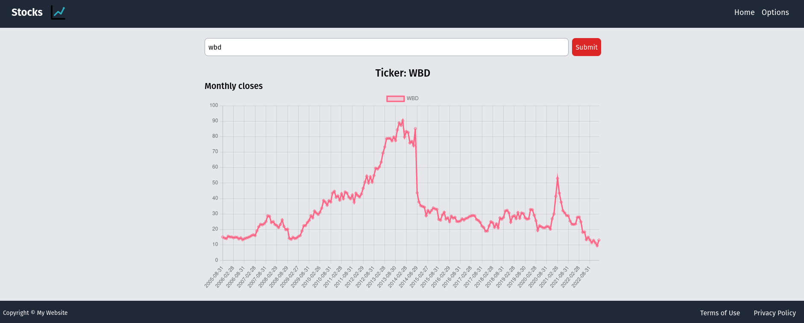

## [Getting stocks from Alpha Vantage API and visualizing on a full stack fastapi / react application - repo link](https://github.com/sergio-abu/FastAPI-Stocks-Visualizer) 




#### Add your api key in app.py.


Clone the repo:
```
git clone https://github.com/sergio-abu/FastAPI-Stocks-Visualizer
```


CD to the repo:
```
cd FastAPI-Stocks-Visualizer
```


Install backend:
```
pipenv install
pipenv shell
```


Then run local server (inside environment):
```
uvicorn app:app --reload
```

Run backend:
```
uvicorn app:app --reload
```


CD to the frontend:
```
cd frontend/stocks-front
```


Install and run frontend:
```
npm install
npm run dev
```
